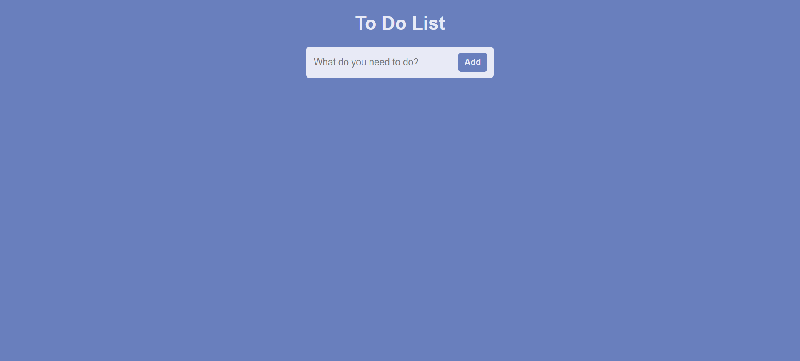
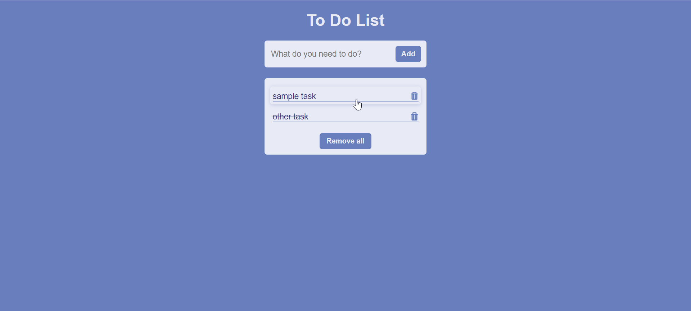

# ToDoList
A simple "To Do List" web application made using:

- MVC design pattern
- The browser's local storage
- Handlebars templating

You can test it [here](https://elitsakarapchanska.github.io/ToDoList).

